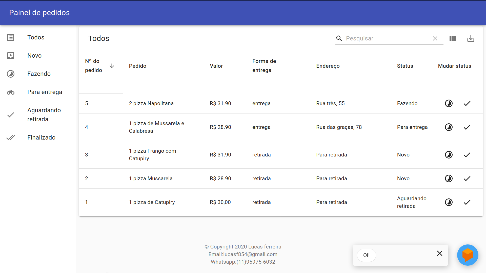
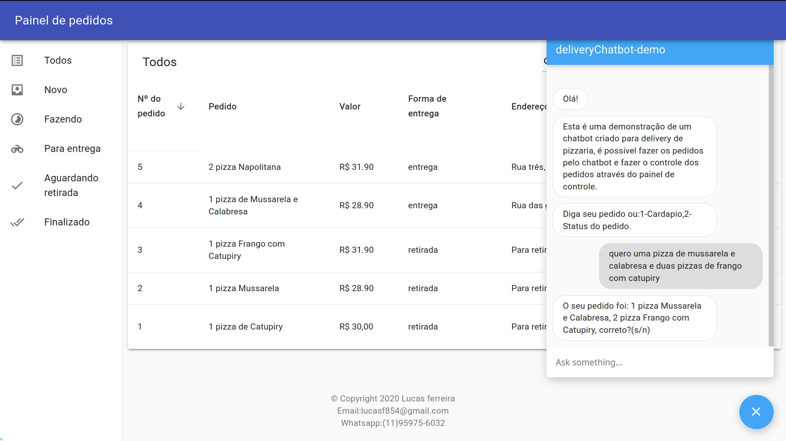
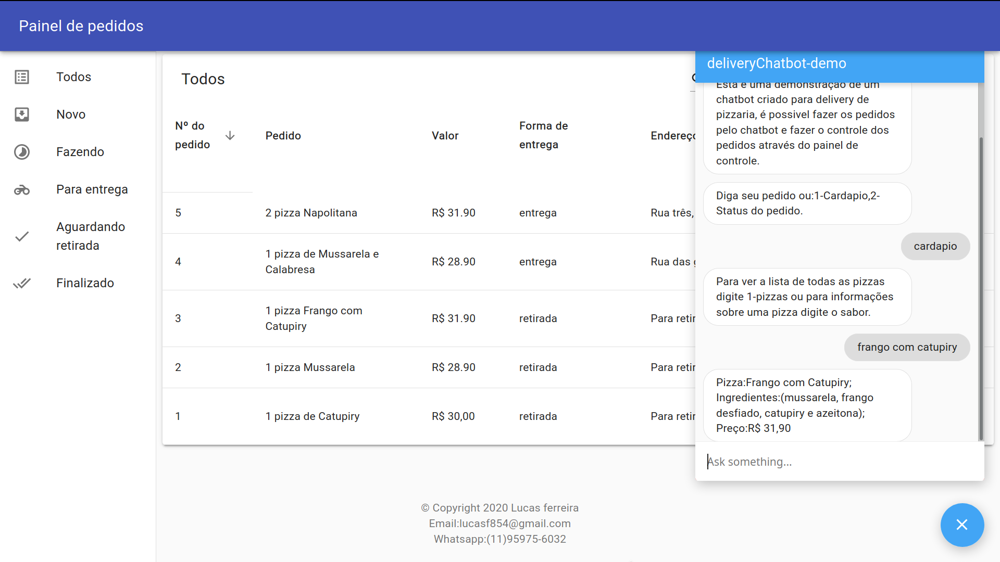

# Delivery chatbot
Chatbot criado para delivery de pizzaria, é possivel fazer pedidos, consultar as opções e verificar o status do pedido através do chatbot.
Os pedidos são enviados para o painel de controle, onde é possivel alterar o status e finalizar os pedidos.  
Feito com Node.js no backend, React.js com Material Ui no frontend e chatbot com o dialogflow da google.  
A demonstração pode ser acessada em:https://painel-delivery.herokuapp.com/

## Prévia

This project was bootstrapped with [Create React App](https://github.com/facebook/create-react-app).

